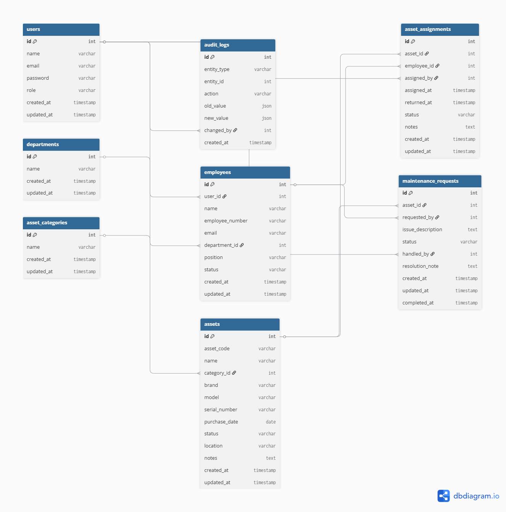
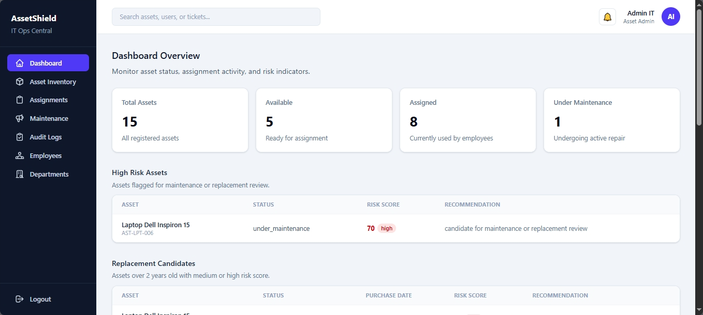
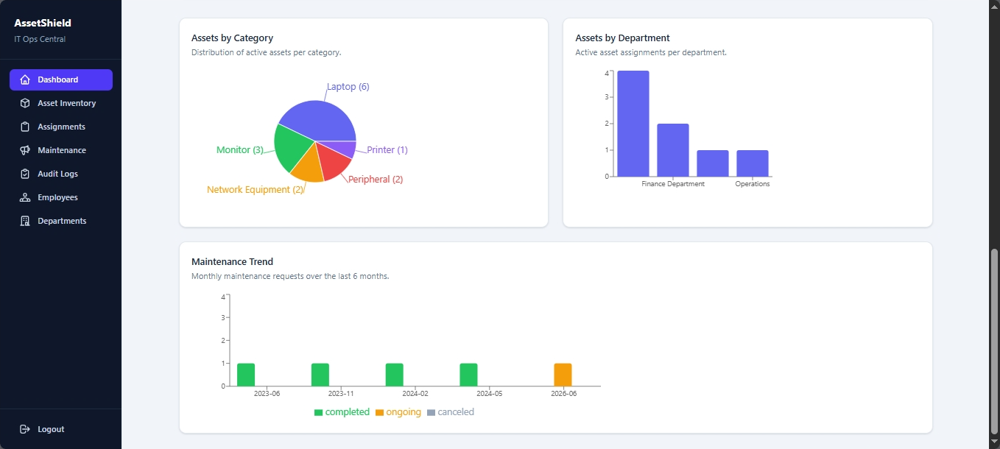
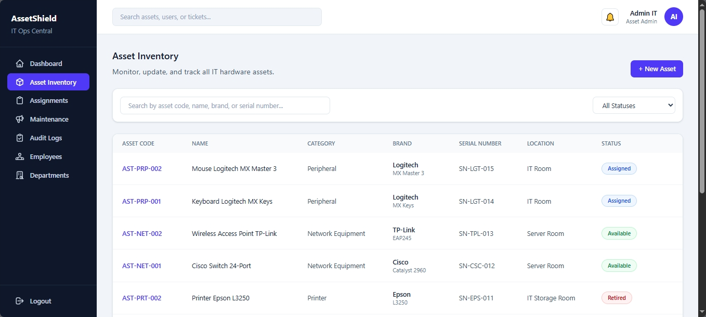
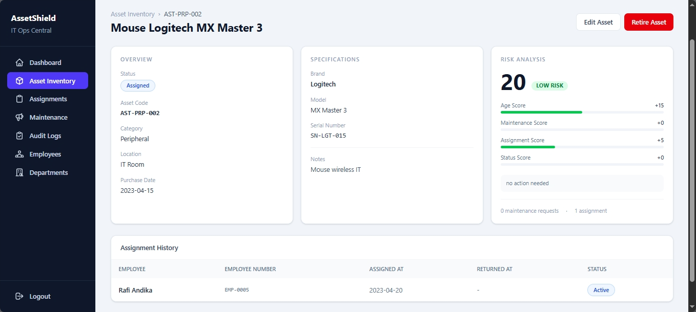
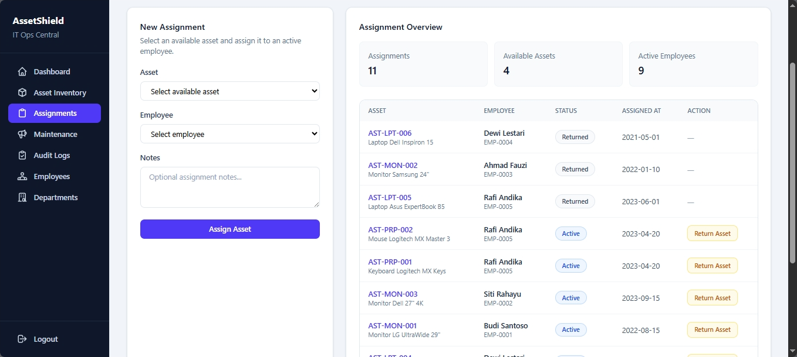
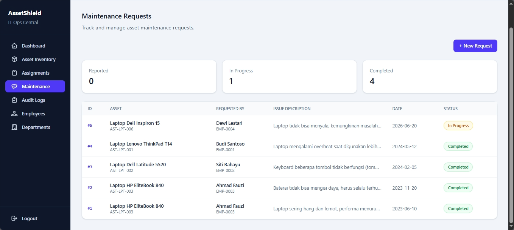
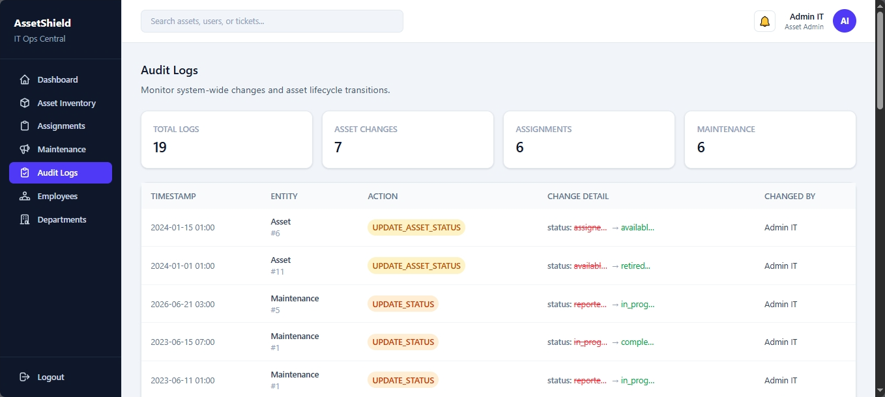
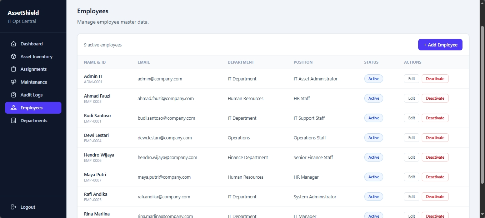

# Internal IT Asset Management & Risk Scoring System

Sistem manajemen aset IT internal perusahaan berbasis fullstack web application. Dibangun untuk melacak aset, assignment ke karyawan, maintenance request, lifecycle status, audit log, dan analitik risiko aset.

Project ini dirancang sebagai sistem internal perusahaan yang realistis, dilengkapi dengan fitur authentication, role-based access control, transactional workflow, dan rule-based risk scoring, sehingga lebih dari sekadar aplikasi CRUD biasa.

---

## Tech Stack

**Backend**

- Node.js + Express.js
- MySQL / MariaDB (mysql2)
- JSON Web Token (JWT)
- bcrypt
- Jest + Supertest

**Frontend**

- React + React Router
- Tailwind CSS
- Recharts

---

## Fitur Utama

- Aktivasi akun karyawan (bukan register bebas)
- JWT authentication + role-based authorization
- CRUD aset IT dengan audit log otomatis
- CRUD kategori aset, employee, dan department
- Assignment aset ke karyawan + return flow
- Maintenance request workflow (reported → in_progress → completed/canceled)
- Audit log untuk setiap operasi penting
- Rule-based asset risk scoring
- Analytics dashboard (overview, by category, by department, maintenance trend, high risk assets, replacement candidates)
- Database transaction untuk workflow kritis
- Unit test untuk endpoint utama

---

## Role & Akses

| Role          | Akses                                                                       |
| ------------- | --------------------------------------------------------------------------- |
| `employee`    | Lihat aset milik sendiri, buat maintenance request                          |
| `asset_admin` | CRUD aset, assignment, return, maintenance, employee, department, audit log |
| `manager`     | Dashboard analytics, risk scoring, monitoring (read-only)                   |

---

## Alur Bisnis Penting

### Aktivasi Akun Karyawan

1. Admin membuat data employee di tabel `employees`.
2. Karyawan aktivasi akun via `POST /api/auth/activate` dengan email + employee number + password.
3. Backend verifikasi kecocokan data, buat user dengan role paksa `employee`, dan link `employees.user_id`.

Karyawan tidak bisa memilih role sendiri.

### Assignment Aset

- Hanya aset berstatus `available` yang bisa di-assign.
- Saat di-assign: status aset berubah ke `assigned`, audit log tercatat.
- Saat dikembalikan: status kembali ke `available`, audit log tercatat.
- Aset tidak bisa dikembalikan saat sedang dalam status `under_maintenance`.

### Maintenance Workflow

- Karyawan hanya bisa request maintenance untuk aset yang aktif di-assign ke dirinya.
- Tidak boleh ada duplikasi request aktif untuk aset yang sama.
- Status flow: `reported` → `in_progress` → `completed` / `canceled`
- Saat `in_progress`: status aset otomatis berubah ke `under_maintenance`.
- Saat `completed`/`canceled`: status aset kembali ke `assigned`.

### Risk Scoring

Sistem menghitung risk score aset berdasarkan 4 faktor:

| Faktor                    | Nilai |
| ------------------------- | ----- |
| Usia aset < 2 tahun       | +5    |
| Usia aset 2–4 tahun       | +15   |
| Usia aset > 4 tahun       | +30   |
| Maintenance request 0     | +0    |
| Maintenance request 1–2   | +15   |
| Maintenance request > 2   | +30   |
| Status available/assigned | +0    |
| Status under_maintenance  | +20   |
| Status retired            | +40   |
| Assignment ≤ 2            | +5    |
| Assignment 3–5            | +10   |
| Assignment > 5            | +15   |

Risk level: `low` (0–30) · `medium` (31–60) · `high` (61+)

---

## Struktur Project

```
.
├── backend/
│   ├── database/
│   │   ├── schema.sql
│   │   └── seed.sql
│   ├── src/
│   │   ├── config/
│   │   ├── controllers/
│   │   ├── middleware/
│   │   ├── models/
│   │   ├── routes/
│   │   └── utils/
│   ├── tests/
│   ├── .env.example
│   ├── app.js
│   ├── server.js
│   └── package.json
├── frontend/
│   ├── src/
│   │   ├── components/
│   │   ├── pages/
│   │   └── utils/
│   └── package.json
├── docs/
│   ├── erd.png
│   └── screenshots/
└── README.md
```

---

## ERD



---

## Screenshots

### Dashboard Overview



### Dashboard Charts



### Asset Inventory



### Asset Detail



### Assignments



### Maintenance Requests



### Audit Logs



### Employees



---

## Instalasi & Setup

### Prasyarat

- Node.js v18+
- MySQL / MariaDB (native, jika tidak menggunakan Docker)
- Docker (opsional, alternatif untuk menjalankan MySQL tanpa instalasi manual)

### 1. Clone repository

```bash
git clone <repository-url>
cd internal-it-asset-management
```

### 2. Setup Backend

```bash
cd backend
npm install
```

Buat file `.env` di dalam folder `backend/`:

```env
PORT=3000
DB_HOST=localhost
DB_USER=root
DB_PASSWORD=your_password
DB_NAME=internal_it_asset
DB_PORT=3306
JWT_SECRET=your_jwt_secret
DB_SSL=false
```

Setup database — pilih salah satu opsi berikut:

**Opsi A — MySQL/MariaDB lokal (XAMPP, dll)**

```bash
mysql -u root -p internal_it_asset < database/schema.sql
mysql -u root -p internal_it_asset < database/seed.sql
```

**Opsi B — MySQL via Docker (tidak perlu install MySQL manual)**

```bash
docker compose up -d db
```

Container otomatis membuat database, mengimpor schema, dan mengisi data demo saat pertama kali dijalankan. Sesuaikan `backend/.env` dengan kredensial berikut (sesuai `docker-compose.yml`):

```env
DB_HOST=localhost
DB_PORT=3306
DB_USER=assetuser
DB_PASSWORD=assetpass
DB_NAME=it_asset_db
DB_SSL=false
```

Jalankan backend:

```bash
npm run dev
```

Backend berjalan di `http://localhost:3000`

### 3. Setup Frontend

```bash
cd frontend
npm install
npm run dev
```

Frontend berjalan di `http://localhost:5173`

---

## Demo Accounts

Setelah import seed data, gunakan akun berikut untuk login:

| Role        | Email                    | Password    |
| ----------- | ------------------------ | ----------- |
| asset_admin | admin@company.com        | password123 |
| manager     | rina.marlina@company.com | password123 |
| employee    | budi.santoso@company.com | password123 |

---

## Menjalankan Test

```bash
cd backend
npm test
```

Coverage saat ini: 13 test case mencakup auth, asset, assignment, maintenance, dan analytics.

---

## API Endpoints

### Auth

| Method | Endpoint             | Akses         | Deskripsi                  |
| ------ | -------------------- | ------------- | -------------------------- |
| POST   | `/api/auth/login`    | Public        | Login, return JWT          |
| POST   | `/api/auth/activate` | Public        | Aktivasi akun karyawan     |
| GET    | `/api/auth/me`       | Authenticated | Get user yang sedang login |

### Employees

| Method | Endpoint             | Akses          | Deskripsi                 |
| ------ | -------------------- | -------------- | ------------------------- |
| GET    | `/api/employees`     | Authenticated  | List semua employee aktif |
| GET    | `/api/employees/:id` | admin, manager | Detail employee           |
| POST   | `/api/employees`     | asset_admin    | Buat employee baru        |
| PUT    | `/api/employees/:id` | asset_admin    | Update employee           |
| DELETE | `/api/employees/:id` | asset_admin    | Deaktivasi employee       |

### Departments

| Method | Endpoint               | Akses         | Deskripsi             |
| ------ | ---------------------- | ------------- | --------------------- |
| GET    | `/api/departments`     | Authenticated | List semua department |
| POST   | `/api/departments`     | asset_admin   | Buat department       |
| PUT    | `/api/departments/:id` | asset_admin   | Update department     |
| DELETE | `/api/departments/:id` | asset_admin   | Hapus department      |

### Asset Categories

| Method | Endpoint                | Akses         | Deskripsi           |
| ------ | ----------------------- | ------------- | ------------------- |
| GET    | `/api/asset-categories` | Authenticated | List semua kategori |
| POST   | `/api/asset-categories` | asset_admin   | Buat kategori baru  |

### Assets

| Method | Endpoint                      | Akses          | Deskripsi                                                                          |
| ------ | ----------------------------- | -------------- | ---------------------------------------------------------------------------------- |
| GET    | `/api/assets`                 | Authenticated  | List aset (filter: `status`, `category_id`, `department_id`, `search`, pagination) |
| GET    | `/api/assets/:id`             | Authenticated  | Detail aset                                                                        |
| POST   | `/api/assets`                 | asset_admin    | Buat aset                                                                          |
| PUT    | `/api/assets/:id`             | asset_admin    | Update aset                                                                        |
| PATCH  | `/api/assets/:id/status`      | asset_admin    | Update status aset                                                                 |
| GET    | `/api/assets/:id/risk-score`  | admin, manager | Risk score aset                                                                    |
| GET    | `/api/assets/:id/assignments` | admin, manager | Assignment history aset                                                            |

### Asset Assignments

| Method | Endpoint                                | Akses          | Deskripsi                |
| ------ | --------------------------------------- | -------------- | ------------------------ |
| GET    | `/api/asset-assignments`                | admin, manager | List semua assignment    |
| GET    | `/api/asset-assignments/:id`            | Authenticated  | Detail assignment        |
| GET    | `/api/asset-assignments/my-assignments` | employee       | Assignment milik sendiri |
| POST   | `/api/asset-assignments`                | asset_admin    | Assign aset ke employee  |
| PATCH  | `/api/asset-assignments/:id/return`     | asset_admin    | Return aset              |

### Maintenance Requests

| Method | Endpoint                                | Akses                 | Deskripsi                |
| ------ | --------------------------------------- | --------------------- | ------------------------ |
| GET    | `/api/maintenance-requests`             | admin, manager        | List semua request       |
| GET    | `/api/maintenance-requests/:id/detail`  | Authenticated         | Detail request           |
| GET    | `/api/maintenance-requests/my-requests` | employee              | Request milik sendiri    |
| POST   | `/api/maintenance-requests`             | employee, asset_admin | Buat maintenance request |
| PATCH  | `/api/maintenance-requests/:id/status`  | asset_admin           | Update status request    |

### Audit Logs

| Method | Endpoint          | Akses          | Deskripsi            |
| ------ | ----------------- | -------------- | -------------------- |
| GET    | `/api/audit-logs` | admin, manager | List semua audit log |

### Analytics

| Method | Endpoint                                | Akses          | Deskripsi                       |
| ------ | --------------------------------------- | -------------- | ------------------------------- |
| GET    | `/api/analytics/overview`               | admin, manager | Ringkasan total aset per status |
| GET    | `/api/analytics/assets-by-category`     | admin, manager | Distribusi aset per kategori    |
| GET    | `/api/analytics/assets-by-department`   | admin, manager | Distribusi aset per department  |
| GET    | `/api/analytics/maintenance-summary`    | admin, manager | Tren maintenance per bulan      |
| GET    | `/api/analytics/high-risk-assets`       | admin, manager | Daftar aset high risk           |
| GET    | `/api/analytics/replacement-candidates` | admin, manager | Kandidat aset untuk replacement |

---

## Error Handling

| Kasus                         | Response                    |
| ----------------------------- | --------------------------- |
| Duplicate unique value        | `409 Conflict`              |
| Invalid foreign key           | `400 Bad Request`           |
| Unauthorized                  | `401 Unauthorized`          |
| Forbidden (role tidak sesuai) | `403 Forbidden`             |
| Data tidak ditemukan          | `404 Not Found`             |
| Server error                  | `500 Internal Server Error` |

---

## Known Limitations

- Audit log mencatat ID teknikal, bukan nama entitas.
- Test menggunakan database development, bukan database test terpisah.
- Faktor "durasi under maintenance" belum diimplementasikan di risk scoring.

---

## CV Positioning

```
Internal IT Asset Management & Risk Scoring System
Built a fullstack web application for managing internal IT assets with role-based access
control, asset assignment tracking, maintenance workflow, audit logs, operational analytics,
and rule-based asset risk scoring using Node.js, Express, MySQL, JWT, React, Tailwind CSS,
and Jest.
```
