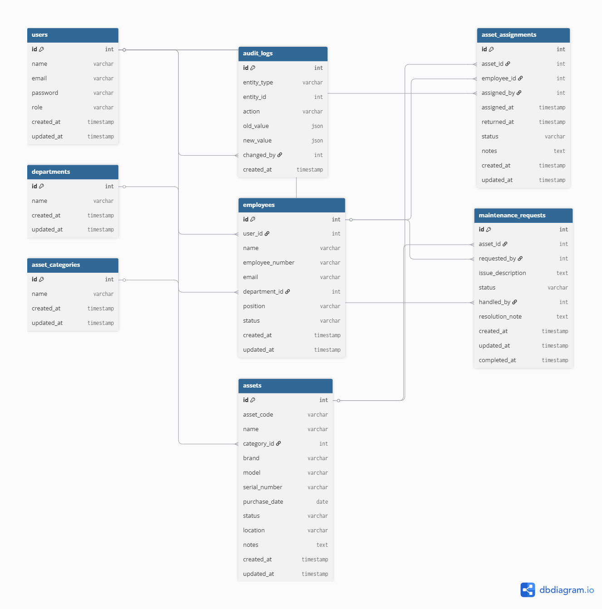
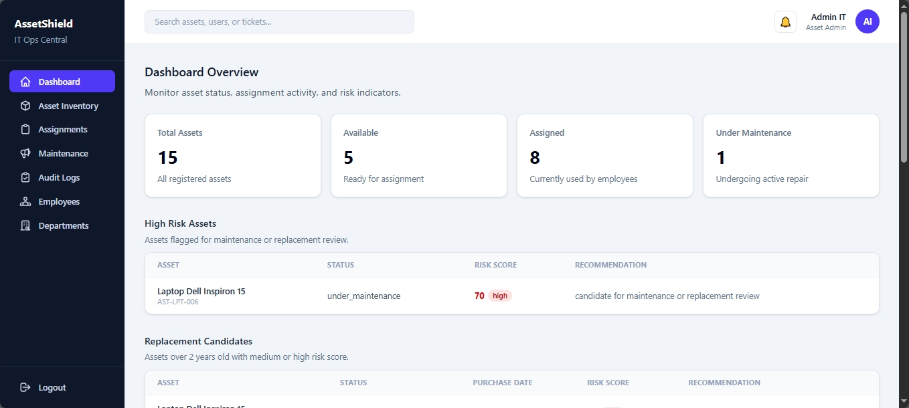
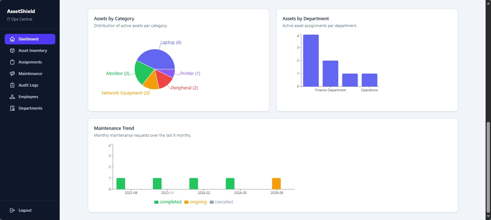
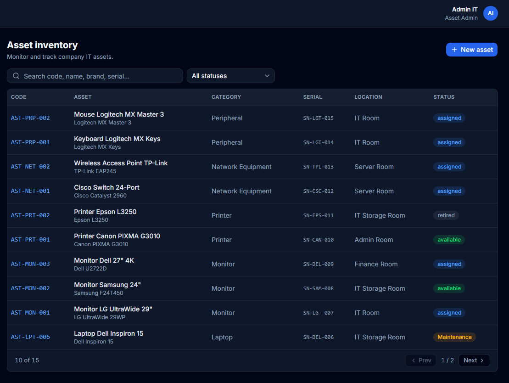
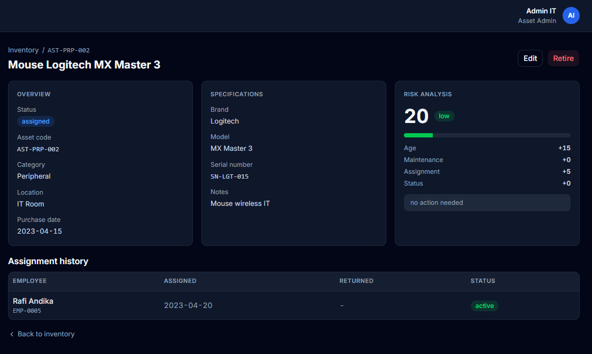
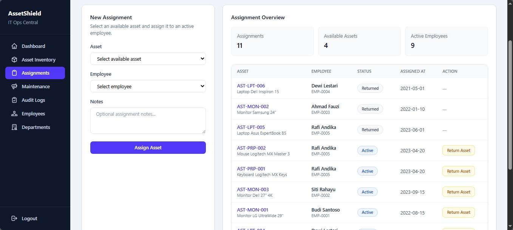
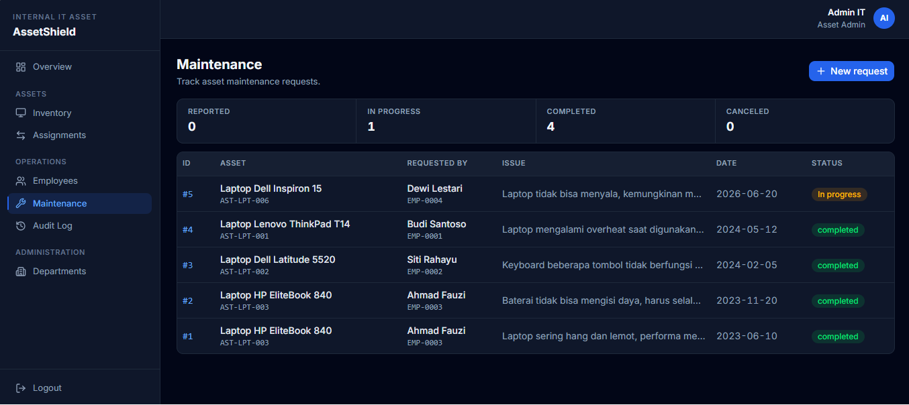
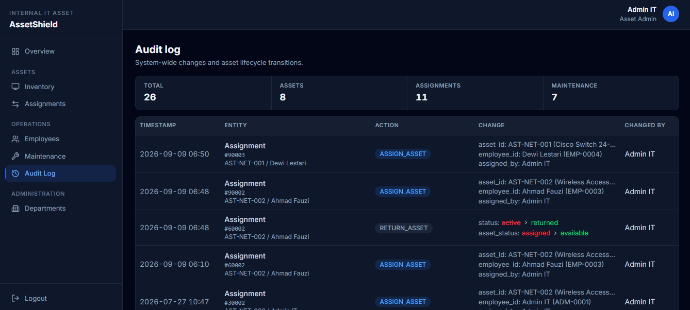
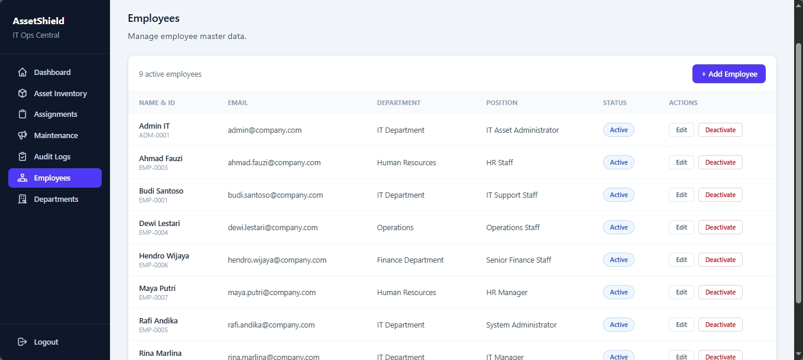

# Internal IT Asset Management & Risk Scoring System

A fullstack web application for managing internal IT assets. Covers asset tracking, employee assignment, maintenance requests, lifecycle status, audit logging, and rule-based risk scoring with authentication and role-based access control.

**Live Demo:** [https://internal-it-asset-management.onrender.com](https://internal-it-asset-management.onrender.com) (cold start may take ~30 seconds on free tier)

---

## Tech Stack

**Backend**

- Node.js + Express.js
- MySQL / MariaDB (mysql2)
- JSON Web Token (JWT)
- bcrypt
- Jest + Supertest

**Frontend**

- React + React Router
- Tailwind CSS
- Recharts

**DevOps**

- Docker (multi-stage build + Nginx for frontend)
- GitHub Actions (CI/CD)
- Render (backend & frontend hosting)

---

## Features

- Employee account activation flow (no open registration)
- JWT authentication + role-based authorization
- IT asset CRUD with automatic audit logging
- Asset category, employee, and department management
- Asset assignment to employees + return flow
- Maintenance request workflow (`reported` → `in_progress` → `completed` / `canceled`)
- Audit log for every significant operation
- Rule-based asset risk scoring
- Analytics dashboard (overview, by category, by department, maintenance trend, high-risk assets, replacement candidates)
- Database transactions for critical workflows
- Unit tests for core endpoints

---

## Roles & Access

| Role          | Access                                                                                     |
| ------------- | ------------------------------------------------------------------------------------------ |
| `employee`    | View own assigned assets, submit maintenance requests                                      |
| `asset_admin` | Full CRUD on assets, assignments, returns, maintenance, employees, departments, audit logs |
| `manager`     | Analytics dashboard, risk scoring, monitoring (read-only)                                  |

---

## Key Business Flows

### Employee Account Activation

1. Admin creates an employee record in the `employees` table.
2. The employee activates their account via `POST /api/auth/activate` using their email, employee number, and a chosen password.
3. The backend verifies the data, creates a user with the role locked to `employee`, and links `employees.user_id`.

Employees cannot self-register or choose their own role.

### Asset Assignment

- Only assets with `available` status can be assigned.
- On assignment: asset status changes to `assigned`, audit log is recorded.
- On return: asset status reverts to `available`, audit log is recorded.
- Assets cannot be returned while in `under_maintenance` status.

### Maintenance Workflow

- Employees can only submit maintenance requests for assets currently assigned to them.
- No duplicate active requests are allowed for the same asset.
- Status flow: `reported` → `in_progress` → `completed` / `canceled`
- On `in_progress`: asset status automatically changes to `under_maintenance`.
- On `completed` / `canceled`: asset status reverts to `assigned`.

### Risk Scoring

The system calculates a risk score for each asset based on four factors:

| Factor                       | Points |
| ---------------------------- | ------ |
| Asset age < 2 years          | +5     |
| Asset age 2–4 years          | +15    |
| Asset age > 4 years          | +30    |
| Maintenance requests: 0      | +0     |
| Maintenance requests: 1–2    | +15    |
| Maintenance requests: > 2    | +30    |
| Status: available / assigned | +0     |
| Status: under_maintenance    | +20    |
| Status: retired              | +40    |
| Assignments ≤ 2              | +5     |
| Assignments 3–5              | +10    |
| Assignments > 5              | +15    |

Risk level: `low` (0–30) · `medium` (31–60) · `high` (61+)

---

## Project Structure

```
.
├── .github/
│   └── workflows/
│       ├── backend-ci-cd.yml
│       └── frontend-ci-cd.yml
├── backend/
│   ├── database/
│   │   ├── schema.sql
│   │   └── seed.sql
│   ├── src/
│   │   ├── config/
│   │   ├── controllers/
│   │   ├── middleware/
│   │   ├── models/
│   │   ├── routes/
│   │   └── utils/
│   ├── tests/
│   ├── .env.example
│   ├── app.js
│   ├── server.js
│   └── package.json
├── frontend/
│   ├── src/
│   │   ├── components/
│   │   ├── pages/
│   │   └── utils/
│   └── package.json
├── docs/
│   ├── erd.png
│   └── screenshots/
└── README.md
```

---

## ERD



---

## Screenshots

### Dashboard Overview



### Dashboard Charts



### Asset Inventory



### Asset Detail



### Assignments



### Maintenance Requests



### Audit Logs



### Employees



---

## Installation & Setup

### Prerequisites

- Node.js v18+
- MySQL / MariaDB (native, if not using Docker)
- Docker (optional, as an alternative to installing MySQL manually)

### 1. Clone the repository

```bash
git clone <repository-url>
cd internal-it-asset-management
```

### 2. Setup Backend

```bash
cd backend
npm install
```

Create a `.env` file inside the `backend/` folder:

```env
PORT=3000
DB_HOST=localhost
DB_USER=root
DB_PASSWORD=your_password
DB_NAME=internal_it_asset
DB_PORT=3306
JWT_SECRET=your_jwt_secret
DB_SSL=false
```

Setup the database. Choose one of the following options:

**Option A: Local MySQL / MariaDB (XAMPP, etc.)**

```bash
mysql -u root -p internal_it_asset < database/schema.sql
mysql -u root -p internal_it_asset < database/seed.sql
```

**Option B: MySQL via Docker (no manual MySQL installation needed)**

```bash
docker compose up -d db
```

The container will automatically create the database, import the schema, and seed demo data on first run. Update `backend/.env` with the following credentials (as defined in `docker-compose.yml`):

```env
DB_HOST=localhost
DB_PORT=3306
DB_USER=assetuser
DB_PASSWORD=assetpass
DB_NAME=it_asset_db
DB_SSL=false
```

Start the backend:

```bash
npm run dev
```

Backend runs at `http://localhost:3000`

### 3. Setup Frontend

```bash
cd frontend
npm install
npm run dev
```

Frontend runs at `http://localhost:5173`

---

## Demo Accounts

After importing the seed data, use the following accounts to log in. You can also click one of the "Login as Demo" buttons on the login page to try each role without entering credentials manually.

| Role        | Email                    | Password    |
| ----------- | ------------------------ | ----------- |
| asset_admin | admin@company.com        | password123 |
| manager     | rina.marlina@company.com | password123 |
| employee    | budi.santoso@company.com | password123 |

---

## Running Tests

```bash
cd backend
npm test
```

Current coverage: 13 test cases covering auth, assets, assignments, maintenance, and analytics.

> Tests run sequentially (`--runInBand`) in CI because all suites share a single database. Running them in parallel causes race conditions between suites that mutate shared data (see CI/CD Pipeline section for details).

---

## CI/CD Pipeline

Backend and frontend each have separate GitHub Actions workflows (`backend-ci-cd.yml` and `frontend-ci-cd.yml`), following the same pattern: **the test/build job must succeed before the deploy job runs**.

```
push to relevant folder (backend/ or frontend/)
        │
        ▼
   job: test/build
   - backend → runs test suite against a MySQL service container (ephemeral, isolated from the development database)
   - frontend → runs `vite build` to catch any compile errors
        │
        ▼ (only continues on success, via `needs`)
   job: deploy
   - curl to Render Deploy Hook
        │
        ▼
   Render pulls latest code → rebuilds via Dockerfile → deploys
```

Key points:

- **Render's "Auto-Deploy on Commit" is disabled** for both services. Deployments only happen via the Deploy Hook triggered by GitHub Actions, ensuring code that fails tests never reaches production.
- **Backend tests run against a MySQL service container**, not the development database (TiDB Cloud). The container lives only for the duration of the job, is seeded from `schema.sql` + `seed.sql`, and is discarded afterwards.
- **Frontend build check runs outside Docker** (`vite build` directly on the runner), so it only catches code errors (syntax, imports, etc.). Docker-specific issues such as `VITE_API_URL` requiring `ARG`/`ENV` in the Dockerfile are only validated when Render performs the actual Docker build and still need to be verified manually after deployment.
- Both workflows can be triggered manually from the **Actions** tab on GitHub (`workflow_dispatch`), without needing a code push.
- Deploy Hook URLs are stored as GitHub Secrets (`RENDER_DEPLOY_HOOK_BACKEND`, `RENDER_DEPLOY_HOOK_FRONTEND`) and never written directly in workflow files.

---

## API Endpoints

### Auth

| Method | Endpoint             | Access        | Description                  |
| ------ | -------------------- | ------------- | ---------------------------- |
| POST   | `/api/auth/login`    | Public        | Login, returns JWT           |
| POST   | `/api/auth/activate` | Public        | Activate employee account    |
| GET    | `/api/auth/me`       | Authenticated | Get currently logged-in user |

### Employees

| Method | Endpoint             | Access         | Description               |
| ------ | -------------------- | -------------- | ------------------------- |
| GET    | `/api/employees`     | Authenticated  | List all active employees |
| GET    | `/api/employees/:id` | admin, manager | Employee detail           |
| POST   | `/api/employees`     | asset_admin    | Create new employee       |
| PUT    | `/api/employees/:id` | asset_admin    | Update employee           |
| DELETE | `/api/employees/:id` | asset_admin    | Deactivate employee       |

### Departments

| Method | Endpoint               | Access        | Description          |
| ------ | ---------------------- | ------------- | -------------------- |
| GET    | `/api/departments`     | Authenticated | List all departments |
| POST   | `/api/departments`     | asset_admin   | Create department    |
| PUT    | `/api/departments/:id` | asset_admin   | Update department    |
| DELETE | `/api/departments/:id` | asset_admin   | Delete department    |

### Asset Categories

| Method | Endpoint                | Access        | Description         |
| ------ | ----------------------- | ------------- | ------------------- |
| GET    | `/api/asset-categories` | Authenticated | List all categories |
| POST   | `/api/asset-categories` | asset_admin   | Create new category |

### Assets

| Method | Endpoint                      | Access         | Description                                                                                                                            |
| ------ | ----------------------------- | -------------- | -------------------------------------------------------------------------------------------------------------------------------------- |
| GET    | `/api/assets`                 | Authenticated  | List assets (filters: `status`, `category_id`, `department_id`, `search`, pagination; use `limit=all` to fetch all without pagination) |
| GET    | `/api/assets/:id`             | Authenticated  | Asset detail                                                                                                                           |
| POST   | `/api/assets`                 | asset_admin    | Create asset                                                                                                                           |
| PUT    | `/api/assets/:id`             | asset_admin    | Update asset                                                                                                                           |
| PATCH  | `/api/assets/:id/status`      | asset_admin    | Update asset status                                                                                                                    |
| GET    | `/api/assets/:id/risk-score`  | admin, manager | Get asset risk score                                                                                                                   |
| GET    | `/api/assets/:id/assignments` | admin, manager | Asset assignment history                                                                                                               |

### Asset Assignments

| Method | Endpoint                                | Access         | Description                |
| ------ | --------------------------------------- | -------------- | -------------------------- |
| GET    | `/api/asset-assignments`                | admin, manager | List all assignments       |
| GET    | `/api/asset-assignments/:id`            | Authenticated  | Assignment detail          |
| GET    | `/api/asset-assignments/my-assignments` | employee       | Current user's assignments |
| POST   | `/api/asset-assignments`                | asset_admin    | Assign asset to employee   |
| PATCH  | `/api/asset-assignments/:id/return`     | asset_admin    | Return asset               |

### Maintenance Requests

| Method | Endpoint                                | Access                | Description                |
| ------ | --------------------------------------- | --------------------- | -------------------------- |
| GET    | `/api/maintenance-requests`             | admin, manager        | List all requests          |
| GET    | `/api/maintenance-requests/:id/detail`  | Authenticated         | Request detail             |
| GET    | `/api/maintenance-requests/my-requests` | employee              | Current user's requests    |
| POST   | `/api/maintenance-requests`             | employee, asset_admin | Submit maintenance request |
| PATCH  | `/api/maintenance-requests/:id/status`  | asset_admin           | Update request status      |

### Audit Logs

| Method | Endpoint          | Access         | Description         |
| ------ | ----------------- | -------------- | ------------------- |
| GET    | `/api/audit-logs` | admin, manager | List all audit logs |

### Analytics

| Method | Endpoint                                | Access         | Description                      |
| ------ | --------------------------------------- | -------------- | -------------------------------- |
| GET    | `/api/analytics/overview`               | admin, manager | Total assets summary by status   |
| GET    | `/api/analytics/assets-by-category`     | admin, manager | Asset distribution by category   |
| GET    | `/api/analytics/assets-by-department`   | admin, manager | Asset distribution by department |
| GET    | `/api/analytics/maintenance-summary`    | admin, manager | Monthly maintenance trend        |
| GET    | `/api/analytics/high-risk-assets`       | admin, manager | High-risk asset list             |
| GET    | `/api/analytics/replacement-candidates` | admin, manager | Replacement candidate assets     |

---

## Error Handling

| Case                          | Response                    |
| ----------------------------- | --------------------------- |
| Duplicate unique value        | `409 Conflict`              |
| Invalid foreign key           | `400 Bad Request`           |
| Unauthorized                  | `401 Unauthorized`          |
| Forbidden (insufficient role) | `403 Forbidden`             |
| Data not found                | `404 Not Found`             |
| Server error                  | `500 Internal Server Error` |

---

## Deployment Notes & Troubleshooting

Technical issues encountered during containerization and deployment, documented as a reference for similar problems.

### Vite Environment Variable Not Baked into Build

**Symptom:** Frontend deploys successfully, but all backend requests fail with `undefined/api/...`. Environment variables set correctly in the platform dashboard appear to be ignored.

**Cause:** Vite inlines environment variables (`import.meta.env.VITE_*`) into the JS bundle **at build time**, not at runtime. Variables set only in the platform dashboard are not automatically available inside the Docker build context. Docker builds run isolated from the container's runtime environment.

**Fix:** Declare the variable explicitly in `Dockerfile` using `ARG` and `ENV`, then pass the value as a build argument during the image build:

```dockerfile
ARG VITE_API_URL
ENV VITE_API_URL=$VITE_API_URL
```

Also ensure the deployment platform is configured to forward the dashboard env var as a build argument, not just as a runtime environment variable.

### CORS Origin Must Match the Browser Exactly

**Symptom:** Requests from the frontend to the backend trigger a CORS error even when `CORS_ORIGIN` is set.

**Cause:** Browsers strip default ports (`:80` for HTTP, `:443` for HTTPS) from the `Origin` header. If `CORS_ORIGIN` is set with an explicit port (`http://localhost:80`) while the browser sends `http://localhost`, they are treated as different origins.

**Fix:** Set `CORS_ORIGIN` without the port when using default ports, and make sure this value is referenced explicitly in your compose file or platform environment config, not just in the local `.env`.

---

## Known Limitations

- Audit logs record technical IDs, not entity names.
- The "duration under maintenance" factor is not yet implemented in risk scoring.
- Test suite runs sequentially rather than in parallel because all suites share a single database per run. Per-file isolation with dedicated transactions is not yet in place.
- No frontend unit tests; the CI build check only verifies that the code compiles, not behavioral correctness.
